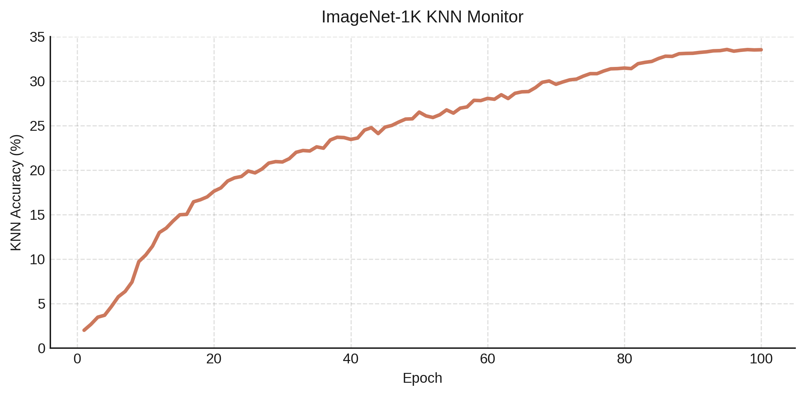

[](https://twitter.com/lucasmaes_)

## nano-simsiam

Welcome to nano-simsiam! A minimalistic, hackable PyTorch implementation of [SimSiam](https://arxiv.org/abs/2011.10566) in ~400 lines of code that achieves competitive performance on ImageNet using standard ResNet50 backbone. The codebase is designed to be single-file and highly tunable with good default parameters, reaching ~33% KNN accuracy (using learned representations) after training for 100 epochs.



As future plans, the codebase will be updated to incorporate recent findings on reducing the computational costs of self-supervised learning models.

### Features

- **Minimal Dependencies**: Only requires PyTorch and torchvision
- **Single File**: Entire implementation in one file (~400 lines) for easy understanding and modification
- **Distributed Training**: Built-in DDP support for multi-GPU training
- **Research Ready**: Clean architecture makes it easy to experiment with:
  - Different backbones (default: ResNet50)
  - Projection head architecture
  - Predictor network design
  - Augmentation strategies
- **Modern Training**: Includes AMP (Automatic Mixed Precision) for faster training
- **KNN Monitor**: Built-in KNN evaluation during training
- **Checkpointing**: Automatic resumption and best model saving

### Quick Start

```bash
# Clone repository
git clone https://github.com/yourusername/nano-simsiam
cd nano-simsiam

# Install requirements
pip install torch torchvision

# Single GPU training
python simsiam.py

# Multi-GPU training
torchrun --nproc_per_node=4 simsiam.py
```

### Data Preparation

#### Getting ImageNet
1. Download ImageNet-1K from [image-net.org](https://image-net.org/)
2. Extract training and validation sets into `datasets/train` and `datasets/val`

#### KNN Monitor Subset
For efficient KNN monitoring during training, we use the ImageNet subsets provided by SimCLR:

```bash
# Download 1% or 10% ImageNet subset files
wget https://raw.githubusercontent.com/google-research/simclr/master/imagenet_subsets/1percent.txt
wget https://raw.githubusercontent.com/google-research/simclr/master/imagenet_subsets/10percent.txt

# Move to datasets directory
mv 1percent.txt 10percent.txt datasets/
```

The default configuration uses the 1% subset. To use the 10% subset, modify:
```python
args.subset_dir = "./datasets/10percent.txt"
```

Directory structure should look like:
```
datasets/
├── train/
│   └── [ImageNet training images]
├── val/
│   └── [ImageNet validation images]
├── 1percent.txt
└── 10percent.txt
```

### 

### Citation

If you use this implementation in your research, please cite:
```
@software{nano_simsiam_2024,
   author = {Maes, Lucas},
   title = {{nano-simsiam}},
   url = {https://github.com/lucas-maes/nano-simsiam},
   year = {2024},
   month = {3}
}
```